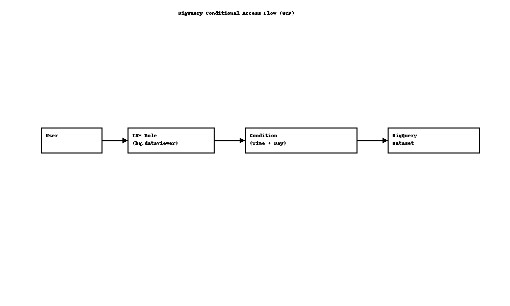

# GCP BigQuery Fraud Access Control Project

## Overview
This project implements conditional IAM policies in Google Cloud Platform (GCP) to restrict access to a BigQuery dataset used for financial fraud analytics.

## Objectives
- Protect BigQuery datasets with context-aware access controls
- Enforce Zero Trust principles using native GCP IAM Conditions
- Demonstrate business-hour and weekday access enforcement

## Key Features
- `roles/bigquery.dataViewer` granted with strict conditions
- Access only allowed:
  - **08:00 to 17:59 UTC**
  - **Monday to Friday**

## Diagram

